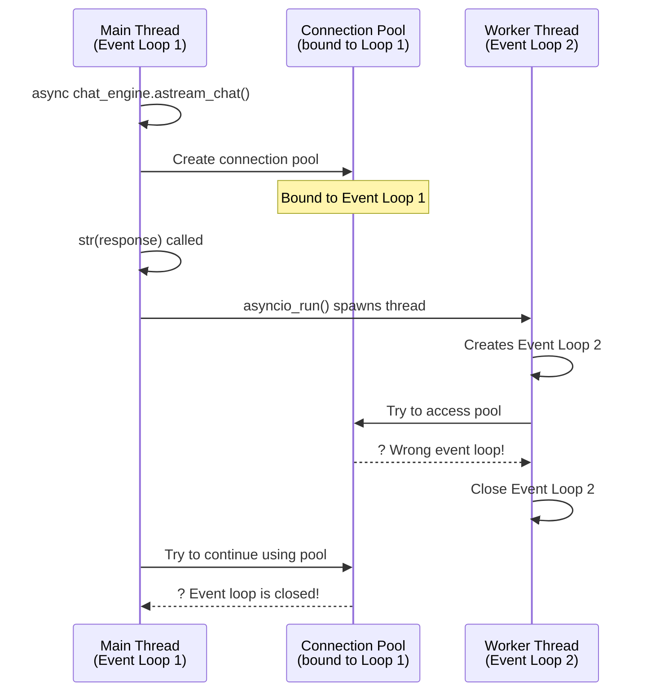

It started with an exception that made no sense: `RuntimeError: Event loop is closed`. The stack trace pointed to a global connection pool - one that should have been perfectly healthy. But somehow, somewhere in our FastAPI application, an event loop was being closed while we were still trying to use it.

This is the story of how a simple string conversion revealed a world of complexity hiding beneath Python's async/await syntax, and how it led me down a rabbit hole comparing async internals across Python, C#, and JavaScript.

## The Exception

Our production logs showed intermittent failures when using LlamaIndex's async streaming responses:

```python
# This innocent-looking code was the culprit
response = await chat_engine.astream_chat("Hello")
print(f"Response: {response}")  # ?? Event loop is closed
```

The error occurred when Python tried to convert the `AsyncStreamingResponse` object to a string for logging. How could a simple string conversion close an event loop?

## The Investigation

Tracing through LlamaIndex's source code, I found the problematic pattern in `AsyncStreamingResponse.__str__()`:

```python
# From llama_index/core/base/response/schema.py
@dataclass
class AsyncStreamingResponse:
    response_gen: TokenAsyncGen
    source_nodes: List[NodeWithScore] = field(default_factory=list)
    metadata: Optional[Dict[str, Any]] = None
    response_txt: Optional[str] = None

    def __post_init__(self) -> None:
        self._lock = asyncio.Lock()

    def __str__(self) -> str:
        """Convert to string representation."""
        return asyncio_run(self._async_str())  # ?? This is the problem

    async def _async_str(self) -> str:
        """Convert to string representation."""
        async for _ in self._yield_response():
            ...
        return self.response_txt or "None"
```

The `__str__` method calls a custom `asyncio_run()` helper. Let's look at that implementation:

```python
# From llama_index/core/async_utils.py
def asyncio_run(coro: Coroutine) -> Any:
    """
    Gets an existing event loop to run the coroutine.
    
    If there is no existing event loop, creates a new one.
    If an event loop is already running, uses threading to run in a separate thread.
    """
    try:
        # Check if there's an existing event loop
        loop = asyncio.get_event_loop()
        
        # Check if the loop is already running
        if loop.is_running():
            # If loop is already running, run in a separate thread
            
            def run_coro_in_thread() -> Any:
                new_loop = asyncio.new_event_loop()  # ?? New loop!
                asyncio.set_event_loop(new_loop)
                try:
                    return new_loop.run_until_complete(coro)
                finally:
                    new_loop.close()  # ?? And it gets closed!
            
            with concurrent.futures.ThreadPoolExecutor(max_workers=1) as executor:
                future = executor.submit(run_coro_in_thread)
                return future.result()
        else:
            # If we're here, there's an existing loop but it's not running
            return loop.run_until_complete(coro)
    
    except RuntimeError as e:
        # If we can't get the event loop, we're likely in a different thread
        try:
            return asyncio.run(coro)
        except RuntimeError as e:
            raise RuntimeError(
                "Detected nested async. Please use nest_asyncio.apply() to allow nested event loops."
                "Or, use async entry methods like `aquery()`, `aretriever`, `achat`, etc."
            )
```

## The Discovery: Multiple Event Loops

Here's what was happening:

1. **FastAPI starts** with an event loop running in the main thread
2. **Our async handler executes** in that event loop, creating a connection pool tied to it
3. **We call `str(response)`** for logging
4. **The `__str__` method detects** the running event loop
5. **It spawns a new thread** with a **new event loop**
6. **This new loop tries to access** the connection pool from the original loop
7. **The new loop closes** when the thread finishes
8. **?? Boom:** "Event loop is closed" when trying to use the pool

Here's a diagram showing the event loop collision:



## The "Aha" Moment

This issue revealed something fundamental about async/await in Python that I'd never fully appreciated: **event loops and resources are tightly coupled**. Connection pools, locks, and other async primitives are bound to specific event loops and can't be safely accessed from different loops.

But this raised more questions:

- Why does Python need this coupling?
- How do other languages handle this?
- What is an event loop anyway, and does C# have one?
- How does JavaScript manage with only one thread?

## The Journey Ahead

This production issue became my gateway to understanding async/await at a much deeper level. Over the course of this blog series, I'll be exploring:

1. **Event loops, task schedulers, and state machines** - How Python's event loop differs from C#'s task scheduler, and why JavaScript needs an event loop but C# doesn't
2. **Thread pools and parallelism** - Understanding concurrency vs parallelism across all three languages
3. **Python's async internals** - Deep dive into asyncio, including why `nest_asyncio` exists and when you'd need it
4. **C#'s async machinery** - How the compiler transforms async/await into state machines, and what `ConfigureAwait(false)` really does
5. **JavaScript's event loop** - Call stacks, microtasks vs macrotasks, and how Node.js differs from browsers
6. **Deadlocks in async code** - Common pitfalls and how to avoid them across all three languages

## The Fix

For our immediate problem, the solution was simple: don't stringify async streaming responses! Instead:

```python
# ? Bad: Forces string conversion which spawns new event loop
print(f"Response: {response}")

# ? Good: Let the response stream naturally
async for chunk in response.async_response_gen():
    print(chunk, end="", flush=True)

# ? Also good: Use the async method explicitly
response_text = await response._async_str()
print(f"Response: {response_text}")
```

But the deeper lesson was this: **synchronous APIs (`__str__`) and async operations don't mix**. When you need to bridge sync and async worlds, you need to be very careful about event loop management.

## Resources

If you want to dive deeper into the specific code discussed here:

- [llama_index response schema source](https://github.com/run-llama/llama_index/blob/main/llama-index-core/llama_index/core/base/response/schema.py) - The `AsyncStreamingResponse` class
- [llama_index async_utils source](https://github.com/run-llama/llama_index/blob/main/llama-index-core/llama_index/core/async_utils.py) - The `asyncio_run()` implementation

And here are some excellent resources I'll be referencing throughout this series:

- [How Async/Await Really Works in C#](https://devblogs.microsoft.com/dotnet/how-async-await-really-works/) by Stephen Toub - A masterclass in C# async internals
- [Async/Await in Python](https://www.youtube.com/watch?v=eiC58R16hb8) by Caleb Hattingh - Excellent talk on Python asyncio
- [JavaScript Visualized: Event Loop](https://www.lydiahallie.com/blog/event-loop) by Lydia Hallie - Beautiful visual explanation of JavaScript's event loop

## Coming Up Next

In the next post, we'll establish the foundational concepts that all three languages use (but in different ways): **event loops, task schedulers, and state machines**. We'll explore what an event loop actually is, why JavaScript and Python need them, and why C# took a completely different approach with `SynchronizationContext` and `TaskScheduler`.

This production bug taught me that understanding these fundamentals isn't just academic - it's essential for writing reliable async code. Join me as we go deeper into the async rabbit hole!
